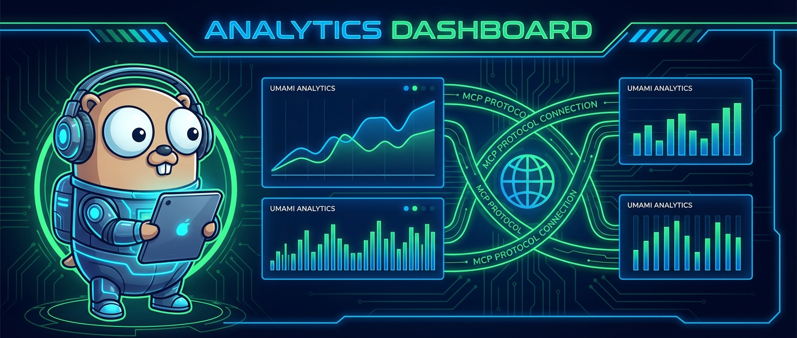

# umami-mcp-server 📈 — Go MCP server for Umami analytics.

<p align="center">
  
</p>

<p align="center">
  
  
  
</p>

A Go implementation of the Model Context Protocol (MCP) server for Umami web analytics. Connects Claude Code and other MCP-compatible AI assistants directly to your Umami analytics data. Ask your AI "how's traffic this week?" instead of opening dashboards. Published to Glama.ai and LobeHub registries.

## Installation

```bash
go install github.com/kevinastuhuaman/umami-mcp-server@latest
```

Add to your MCP client config (e.g., Claude Code `settings.json`):

```json
{
  "mcpServers": {
    "umami": {
      "command": "umami-mcp-server",
      "env": {
        "UMAMI_URL": "https://your-umami-instance.com",
        "UMAMI_USERNAME": "admin",
        "UMAMI_PASSWORD": "your-password"
      }
    }
  }
}
```

## What it does

- MCP server that exposes Umami analytics data to AI assistants
- Query page views, sessions, events, and custom metrics via natural language
- Supports date ranges, filtering, and aggregation
- Works with Claude Code, Cursor, and any MCP-compatible client
- Published to Glama.ai and LobeHub MCP registries

## How it works

```
MCP client (Claude Code / Cursor)
    |
    v
Connects to umami-mcp-server via stdio
    |
    v
Server translates MCP tool calls to Umami API requests
    |
    v
Returns structured analytics data
    |
    v
AI assistant analyzes and answers questions about your traffic
```

## Tech stack

- **Language:** Go
- **Protocol:** Model Context Protocol (MCP) via stdio
- **API:** Umami REST API
- **Distribution:** Go binary, published to Glama.ai + LobeHub

## What I learned

- MCP is a natural fit for analytics — instead of building dashboards, just ask your AI "how's traffic this week?"
- Go's single-binary distribution makes MCP servers trivially deployable — no runtime dependencies
- Publishing to MCP registries (Glama.ai, LobeHub) gave the project discovery I wouldn't have gotten from GitHub alone
